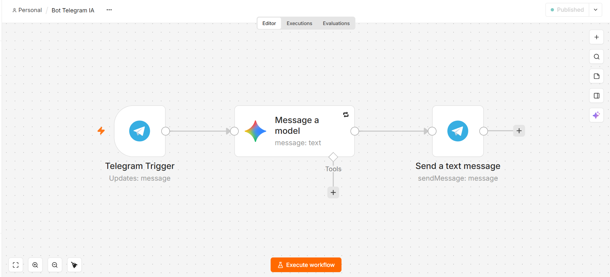
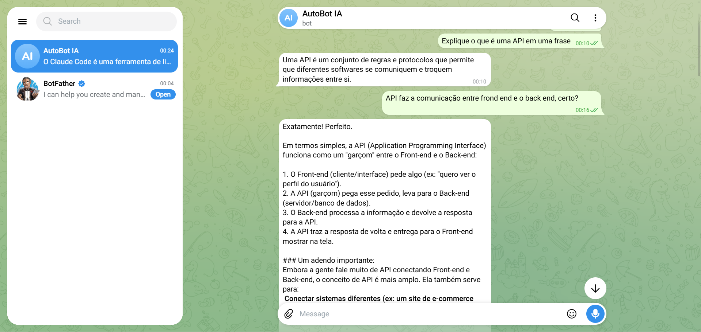

# Bot do Telegram com IA (n8n + Gemini)

Bot do Telegram que responde mensagens usando inteligência artificial. O usuário envia uma pergunta no chat, o n8n recebe via webhook, envia o texto para o Google Gemini e devolve a resposta no mesmo chat.

## Fluxo

```
Usuário (Telegram)
       │  mensagem
       ▼
Telegram Bot API
       │  webhook (HTTPS)
       ▼
ngrok (túnel público)
       │
       ▼
n8n local (localhost:5678)
  ├─ Telegram Trigger      → recebe a mensagem
  ├─ Google Gemini         → gera a resposta
  └─ Telegram Send Message → responde no chat
       │
       ▼
Usuário recebe a resposta
```

## Tecnologias

- **n8n** (self-hosted, local): orquestração do fluxo
- **Telegram Bot API**: entrada e saída das mensagens
- **Google Gemini API** (modelo Flash-Lite, plano gratuito): geração das respostas
- **ngrok** (plano gratuito): túnel HTTPS para expor o n8n local

## Como rodar

### Pré-requisitos

- Node.js e n8n instalados (`npm install -g n8n`)
- ngrok instalado e autenticado (versão 3.20 ou superior)
- Bot criado no Telegram pelo **@BotFather** (gera o token)
- Chave da API do Gemini gerada no **Google AI Studio**

### Passo a passo

1. **Inicie o túnel do ngrok** (deixe a janela aberta):
   ```powershell
   ngrok http --url=SEU-DOMINIO.ngrok-free.dev 5678
   ```

2. **Inicie o n8n** em outro terminal, apontando para a URL do ngrok:
   ```powershell
   $env:WEBHOOK_URL="https://SEU-DOMINIO.ngrok-free.dev/"
   n8n
   ```

3. Acesse **http://localhost:5678** e importe o arquivo `workflow/workflow.json` (menu **⋯ → Import**).

4. Crie as credenciais no n8n:
   - **Telegram API**: token do bot
   - **Google Gemini (PaLM) API**: chave do AI Studio

5. Selecione as credenciais nos nós e **ative** o workflow.

6. Envie uma mensagem para o bot no Telegram.

> As credenciais ficam armazenadas criptografadas no n8n. O arquivo `workflow.json` contém apenas referências a elas, sem tokens ou chaves.

## Prints

### Workflow no n8n


### Conversa com o bot


## Melhorias futuras

- Memória de conversa (o bot hoje responde cada mensagem de forma independente)
- Tratamento de mensagens que não são texto (áudio, imagem)
- Reduzir a latência quando a API do Gemini está instável

## Autor

Gabriel Moreira Melo, estudante de Análise e Desenvolvimento de Sistemas (ULBRA)

## Correção de Erros 
- **Erro 503 (Service unavailable) no Gemini**
- **Causa:** o modelo estava sobrecarregado no servidor do Google, o que é comum no plano gratuito. A mensagem chegava, mas o usuário ficava sem resposta.
- **Solução:** ativei o *Retry On Fail* no nó (3 tentativas, 3 s de intervalo) e troquei para o modelo Flash-Lite, mais leve.
- **Resultado:** o bot responde mesmo com instabilidade na API, só com alguns segundos de atraso.
